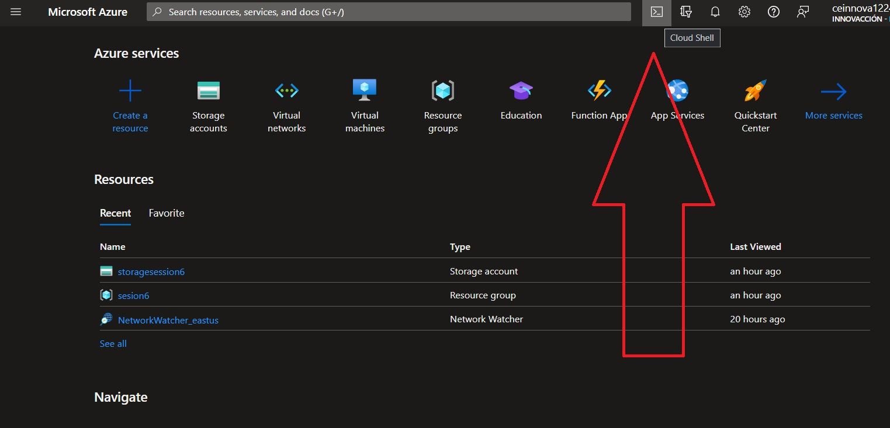
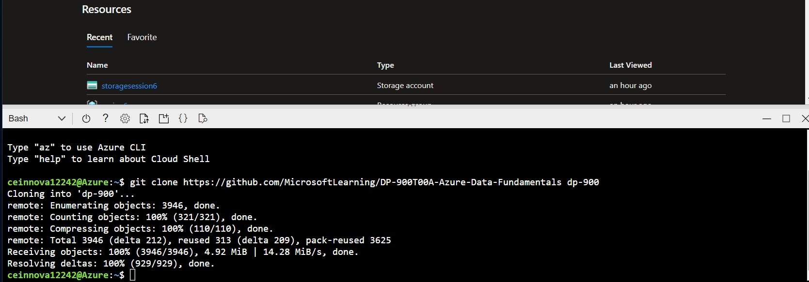
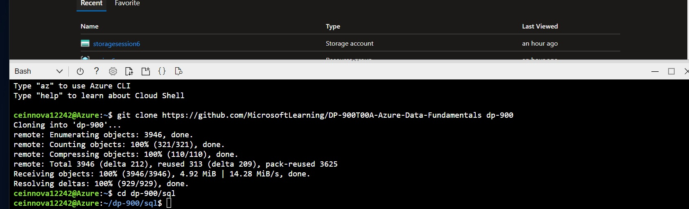
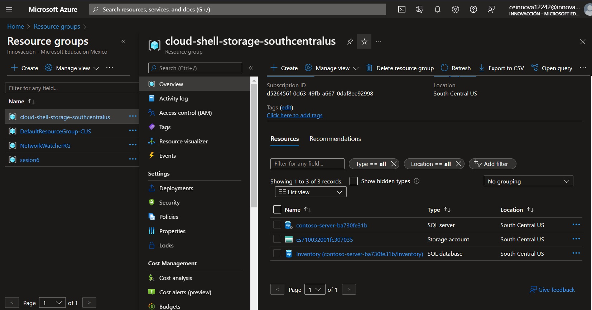
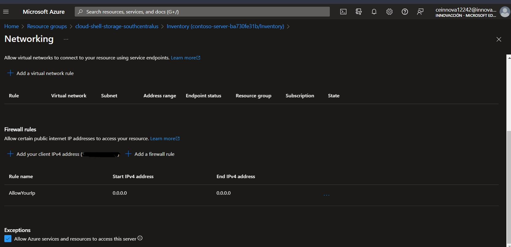
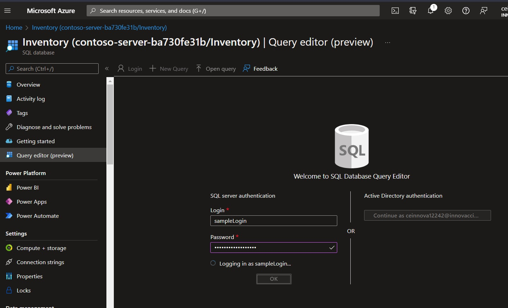
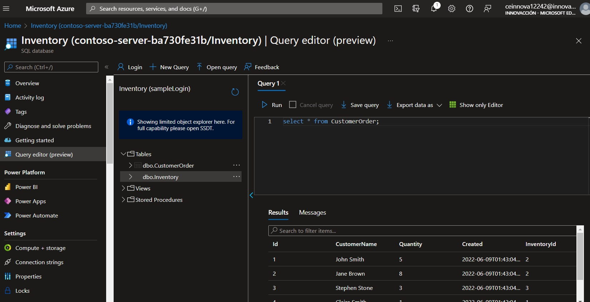

# Practice Query SQL Database

----------------------------------------------------------------

 ## Process:
##### -We started session in  [Azure](https://www.portal.azure.com)
##### -We need to click on CloudShell

##### -Paste the next sentence and enter:
##### git clone https://github.com/MicrosoftLearning/DP-900T00A-Azure-Data-Fundamentals dp-900 

##### -We move to the another folder
## ##cd dp-900/sql

##### -Execute the following command:
## bash setup.sh
##### -Wait a moment for the execution to finish.

##### -We move to the resource where created the SQL.

##### -Open SQL database.
##### -In overview, we click on "Set server firewall".
##### -We scroll down to the firewall rules and click on add your client IPv4 address and save.

##### -We have to select "Query editor".
##### -We have to log in.

##### -Open Table folder.
##### -Execute any query you want.

## 🔥Congratulations.! You did a SQL Query 🔥
